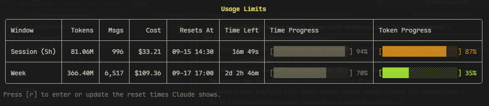

# AIUsageMonitor

[](https://github.com/coldhighsun/AIUsageMonitor/actions/workflows/ci.yml)
[](LICENSE)
[](https://dotnet.microsoft.com/)
[](https://github.com/coldhighsun/AIUsageMonitor/releases/latest)
[](https://github.com/coldhighsun/AIUsageMonitor/releases)
[](https://www.nuget.org/packages/AIUsageMonitor.Cli)
[](#projects)
[](https://github.com/coldhighsun/AIUsageMonitor/commits/main)

[English](#english) | [中文](#chinese)

---

<a id="english"></a>
## English

A read-only analytics layer over Claude Code's own local usage data. It never calls the Anthropic API — it reads the files Claude Code already writes under `~/.claude` (`stats-cache.json`, `history.jsonl`, `projects/*.jsonl` session transcripts) and turns them into daily/period/model/hourly/session usage reports and cost estimates.

### Projects

- **AIUsageMonitor.Core** — class library with the data parsing and analytics engine. No dependency on Cli/WPF.
- **AIUsageMonitor.Cli** — console app (`aimon`) exposing usage reports as CLI commands.
- **AIUsageMonitor.WPF** — Windows desktop dashboard (WPF, Windows-only).

### Install

via [winget](https://learn.microsoft.com/en-us/windows/package-manager/winget/)

```
winget install coldhighsun.AIUsageMonitor.Cli
```

Or via [dotnet tool](https://learn.microsoft.com/en-us/dotnet/core/tools/global-tools-how-to-use) (cross-platform):

```
dotnet tool install --global AIUsageMonitor.Cli
```

Or build from source:

```
dotnet build AIUsageMonitor.slnx
```

### CLI usage

```
aimon <command>
```

(or, from source: `dotnet run --project src/AIUsageMonitor.Cli -- <command>`)

> 💡 **Start with `aimon watch`** — it's the recommended way to use this tool day-to-day: a live-updating view of your current session and weekly limits, so you always know how much headroom you have left.

Commands:

- `watch` — **(recommended)** live-updating view (`limits|today|week|models|sessions|hours`, default `limits`), refreshed on an interval
- `today` — today's usage
- `week` — current week's usage
- `month` — current month's usage
- `models` — usage broken down by model
- `sessions` — per-session summaries
- `hours` — usage broken down by hour of day
- `export` — export raw analytics; supports `--format json|csv` and `--output <path>` (defaults to stdout, JSON)

`watch`'s default view, `limits`, approximates the "Current Session" (rolling 5-hour window) and "This Week" panels from Claude's own account UI, each with a **Time Progress** bar (how far the window has elapsed, colored green/orange when token usage is pacing notably behind/ahead of it) and a **Token Progress** bar (how close it is to its budget). For the session window, a pace hint also appears below the table when token usage is running noticeably ahead of or behind elapsed time, suggesting you slow down or use more freely.

The real reset times and token limits live on your Anthropic account, not locally, so pin them once:

- `--session-reset "HH:mm"` — the session reset time Claude shows (e.g. `"18:30"`)
- `--week-reset "Ddd HH:mm"` — the weekly reset (e.g. `"Mon 09:00"`); fixed per account, so it only needs entering once, unlike the session reset
- `--session-token-progress <percent>` / `--week-token-progress <percent>` — the usage % Claude shows (e.g. `32`), used to back out a token budget

Without these, values are estimated from local transcript timestamps, and a row shows as **unknown** rather than a guessed countdown when there isn't enough local evidence (no activity in the last 5 hours, or no weekly anchor at all).

Press `r` while `watch` is running to re-enter any of the four (Enter keeps the current value). In an interactive terminal, unset values are prompted for once up front and saved to `%LOCALAPPDATA%/aimon/limits-settings.json` (or the OS equivalent) for future runs.



### Update checks

Every command checks GitHub for a newer release once after it finishes (`watch` checks once before entering its refresh loop and keeps the notice pinned to the bottom of the view for the whole session). If a newer version is available, a one-line notice with the new version and a link to the release is printed — this never blocks or fails the command, and no data is sent beyond the standard GitHub API request for the latest release.

### WPF dashboard (Windows only)

> **⚠️ Work in progress — not ready for use yet.** The WPF project is still under active development; expect missing features and rough edges. Use the CLI (`aimon`) for now.

```
dotnet run --project src/AIUsageMonitor.WPF
```

Polls usage data once per minute and renders daily/model/hourly charts.

### How it works

Provider-specific parsing (`Providers/<Name>/`, e.g. `Providers/Claude/`) feeds `Analytics/UsageAnalyzer`, exposed through `Services/DataService` to both the CLI and the WPF app. See [CLAUDE.md](CLAUDE.md) for the full data-flow breakdown.

### Releases

Pushing a `v*` tag builds self-contained CLI binaries for win-x64/linux-x64/osx-x64/osx-arm64, attaches them to a GitHub release, and publishes the `aimon` dotnet tool to NuGet (see `.github/workflows/ci.yml`).

### License

MIT — see [LICENSE](LICENSE).

---

<a id="chinese"></a>
## 中文

一个基于 Claude Code 本地使用数据的**只读**分析工具。它从不调用 Anthropic API，只读取 Claude Code 自身已经写入 `~/.claude` 目录下的文件(`stats-cache.json`、`history.jsonl`、`projects/*.jsonl` 会话记录),并将其转换为按天/按周期/按模型/按小时/按会话的用量报告与成本估算。

### 项目结构

- **AIUsageMonitor.Core** — 数据解析与分析引擎所在的类库,不依赖 Cli/WPF。
- **AIUsageMonitor.Cli** — 控制台程序(命令名 `aimon`),以命令行方式输出用量报告。
- **AIUsageMonitor.WPF** — Windows 桌面仪表盘(WPF,仅支持 Windows)。

### 安装

通过 [winget](https://learn.microsoft.com/en-us/windows/package-manager/winget/) 安装:

```
winget install coldhighsun.AIUsageMonitor.Cli
```

或通过 [dotnet tool](https://learn.microsoft.com/en-us/dotnet/core/tools/global-tools-how-to-use) 安装(跨平台):

```
dotnet tool install --global AIUsageMonitor.Cli
```

或从源码构建:

```
dotnet build AIUsageMonitor.slnx
```

### CLI 用法

```
aimon <命令>
```

(或从源码运行:`dotnet run --project src/AIUsageMonitor.Cli -- <命令>`)

> 💡 **优先使用 `aimon watch`** —— 这是日常使用本工具的推荐方式:实时展示当前会话和每周额度的用量情况,让你随时掌握剩余空间。

可用命令:

- `watch` — **(推荐)** 实时刷新视图(`limits|today|week|models|sessions|hours`,默认为 `limits`),按指定间隔自动刷新
- `today` — 今日用量
- `week` — 本周用量
- `month` — 本月用量
- `models` — 按模型统计用量
- `sessions` — 每个会话的用量汇总
- `hours` — 按小时统计用量
- `export` — 导出原始分析数据;支持 `--format json|csv` 与 `--output <path>`(默认输出到标准输出,格式为 JSON)

`watch` 的默认视图 `limits` 近似展示 Claude 官方账户界面中的 "Current Session"(滚动 5 小时窗口)和 "This Week" 面板,各自附带 **Time Progress**(窗口已过去的时间比例,当 token 消耗明显落后/领先于时间进度时会分别显示绿色/橙色)与 **Token Progress**(用量占预算的比例)两条进度条。针对当前会话窗口,当 token 消耗进度明显快于或慢于时间进度时,表格下方还会出现一条节奏提示,建议你放慢或可以放心多用。

真实的重置时间和 token 上限存储在 Anthropic 账号侧,本地无法读取,建议各录入一次:

- `--session-reset "HH:mm"` — Claude 显示的会话重置时间(如 `"18:30"`)
- `--week-reset "Ddd HH:mm"` — 每周重置时刻(如 `"Mon 09:00"`);账号固定不变,只需录入一次,不会像会话那样过期
- `--session-token-progress <百分比>` / `--week-token-progress <百分比>` — Claude 显示的用量百分比(如 `32`),用来反推出 token 预算

不配置这些参数时,会根据本地会话记录估算;当本地证据不足时(近 5 小时无活动,或压根没有周期锚点),对应行会显示为**未知**,而不是编造一个倒计时。

在 `watch` 运行中按 `r` 可随时重新录入以上四项(直接回车保留当前值)。在交互式终端中,未配置的项会一次性提示输入,并保存到 `%LOCALAPPDATA%/aimon/limits-settings.json`(或对应系统的等效路径)供后续运行复用。


### 更新检查

每个命令执行结束后都会检查一次 GitHub 上是否有新版本发布(`watch` 会在进入刷新循环前检查一次,并在整个运行期间将提示固定显示在视图底部)。如果有新版本,会打印一行提示,附带新版本号和发布页链接——这不会阻塞或影响命令本身的执行,除了标准的 GitHub 最新发布查询请求外不会发送任何其他数据。

### WPF 仪表盘(仅 Windows)

> **⚠️ 尚在开发中,暂不建议使用。** WPF 项目目前仍在积极开发,功能不完整,可能存在明显问题。请先使用 CLI(`aimon`)。

```
dotnet run --project src/AIUsageMonitor.WPF
```

每分钟轮询一次用量数据,并渲染按天/按模型/按小时的图表。

### 工作原理

各数据源的专属解析代码位于 `Providers/<名称>/` 下(如 `Providers/Claude/`),结果汇入 `Analytics/UsageAnalyzer`,再通过 `Services/DataService` 统一供 CLI 与 WPF 两端使用。完整的数据流细节见 [CLAUDE.md](CLAUDE.md)。

### 发布

推送 `v*` 标签会为 win-x64/linux-x64/osx-x64/osx-arm64 构建自包含的 CLI 二进制文件,附加到 GitHub Release,并将 `aimon` dotnet 工具发布到 NuGet(详见 `.github/workflows/ci.yml`)。

### 许可协议

MIT — 详见 [LICENSE](LICENSE)。
